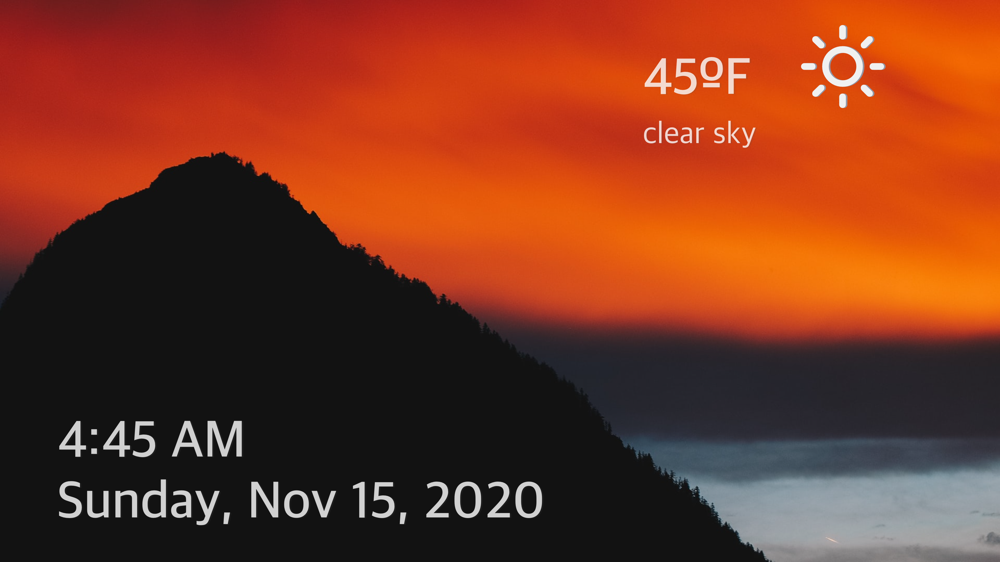

#  Daily Dashboard

### Overview
---
Daily Dashboard is a simple tvOS app that does a few things: presents the local time of where ever the AppleTV is that the app is running on, presents an image of a U.S. National Park randomly from a curated list, and gives you the current temperature and weather.

### Motivation
---
In my journey to learn Swift and iOS programming, I found tvOS to have some helpful constraints. tvOS doesnt get too bogged down in layout and constraint issues like iOS or iPadOS. You're not having to concern yourself with different sized devices or landscape and portrait orientations. Also, tvOS apps are largely supposed to help a user consume content or information. So designing a complex interface is actually discouraged. With these constraints, I was able to focus on what I wanted to learn more about, which in this case was making network calls and displaying the data I got back.

### Running the app:
---
- Clone this repo down to a local machine.
- Make sure you are running Xcode 11.6 (11E708).
- Make sure you are have Swift 5.2.4 installed (in terminal run this command to check: swift --version).
- Build and run the app (⌘-R in Xcode)
- enjoy!

